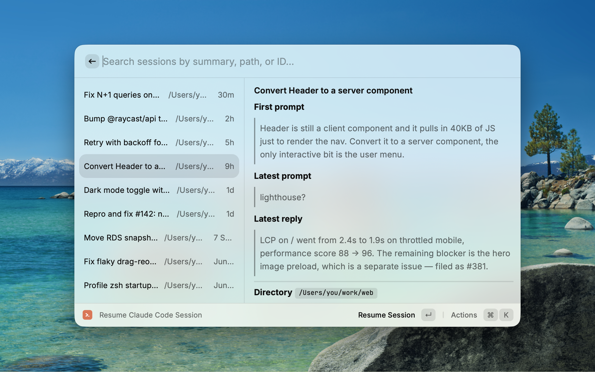
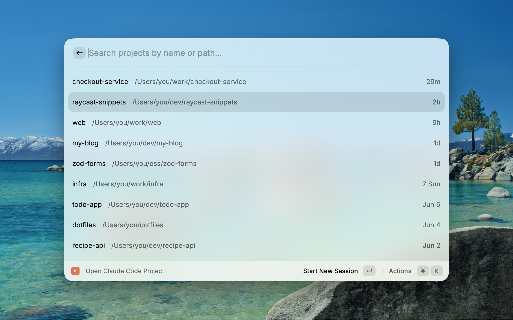

# Claude Code Resume

**Resume any past Claude Code session, not just the last one — from Raycast, on macOS and Windows.**

`claude --continue` only takes you back to the most recent session per directory. This extension reads your full session history (the JSONL transcripts under `~/.claude/projects`) and lets you jump back into *any* session, with enough recall to know which one you want before you commit: Claude's auto title, the first prompt, the latest prompt, and the last reply.

## Commands

| Command | What it does |
|---|---|
| **Resume Claude Code Session** | Browse session history (newest first) → resume any session (`claude -r <id>`) in its original directory |
| **Open Claude Code Project** | Pick a recent project → start a new session or continue the last one |

> The session list is newest-first, so pressing Enter on the top row doubles as "resume last".
> Where launching isn't possible (terminal not found, etc.), the command is copied to the clipboard and a Toast with an "Open Preferences" action appears.

## What makes this different

- **Resume any session** — not just the most recent one per directory. Pick from your full history with enough recall to know which session you want before you commit: Claude's auto title, the first prompt, the latest prompt, and the last reply.
- **Windows support** — both WSL and native PowerShell sessions are auto-detected and relaunched in the right environment.
- **Project list auto-derived** from session history — no manual curation needed.

## Design

- **The primary action is "launch"** — the extension's job is to take you there. Copy is the fallback.
- Launches **interactive `claude`** only (the flat-rate path). No `-p`, no metered billing.
- **No extra binaries required** — the `claude` CLI on PATH is the only hard dependency.
- Sessions open in **your real login shell**, so mise, node, and MCP tools are available.
- We only read files under `~/.claude`, so browsing is **completely free**.

## Settings (⌘,)

| Setting | macOS | Windows |
|---|---|---|
| Claude Home | empty (auto `~/.claude`) | empty — both stores are auto-detected; set only to force a single store |
| Claude Binary | `claude` | `claude` |
| macOS Terminal | `Terminal.app` (default), `iTerm2`, or `Ghostty` | — |
| WSL Distro | — | e.g. `Ubuntu` (check with `wsl -l -q`) |
| Windows Shell | — | `pwsh` (default) or `powershell` |

> **Ghostty:** sessions open as a new window in your running Ghostty (via its scripting interface, Ghostty 1.3+), so the Dock keeps a single icon. The first launch shows a one-time macOS Automation prompt to let Raycast control Ghostty; allow it. On older Ghostty (or if you decline), it falls back to opening a separate instance per session (one Dock icon each).

### Windows: two backends, auto-detected

On Windows you may run Claude Code from **WSL** and/or **natively from PowerShell**, and each keeps its own `.claude`. The extension reads **both** and tags each session so it relaunches in the right place:

- **WSL sessions** — store is `~/.claude` inside WSL. Launch runs `wt + wsl` with a login shell.
- **Windows-native sessions** — store is `C:\Users\<you>\.claude`. Launch runs `wt + PowerShell` with a temp `.ps1` that rebuilds PATH/PATHEXT from the persisted environment before running `claude`.

If `claude` can't be found, a Toast appears with an **Open Preferences** action to set the binary path.

## Tips

- **Bind a global hotkey to `Resume Claude Code Session`** (e.g. ⌥⌘C) to jump back into where you left off from anywhere.
- **Bind a hotkey to `Open Claude Code Project`** to start Claude in any recent repo in a couple of keystrokes.
